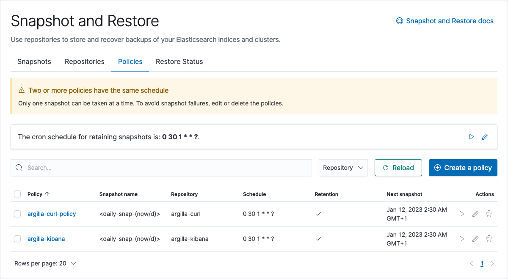

# Elasticsearch

This section explains advanced configurations to use Argilla with Elasticsearch instances or clusters.
(configure-elasticsearch-role-users)=
## Configure roles and users

If you have an Elasticsearch instance and want to share resources with other applications, you can easily configure it for Argilla.

All you need to take into account is:


* Argilla will create its ES indices with the following pattern `.argilla*`. It's recommended to create a new role (e.g., argilla) and provide it with all privileges for this index pattern.

* Argilla creates an index template for these indices, so you may provide related template privileges to this ES role.

Argilla uses the `ELASTICSEARCH` environment variable to set the ES connection.

You can provide the credentials using the following scheme:

```bash
http(s)://user:passwd@elastichost
```

Below you can see a screenshot for setting up a new *argilla* Role and its permissions:


## Change index analyzers

By default, for indexing text fields, Argilla uses the `standard` analyzer for general search and the `whitespace`
analyzer for more exact queries (required by certain rules in the weak supervision module). If those analyzers
don't fit your use case, you can change them using the following environment variables:
`ARGILLA_DEFAULT_ES_SEARCH_ANALYZER` and `ARGILLA_EXACT_ES_SEARCH_ANALYZER`.

Note that provided analyzers names should be defined as built-in ones. If you want to use a
customized analyzer, you should create it inside an index_template matching Argilla index names (`.argilla*.records-v0),
and then provide the analyzer name using the specific environment variable.

## Reindex data

Sometimes updates require reindexing our dataset metrics and Elasticsearch, therefore we devised some [short documentation](../../guides/features/datasets) to show you how to do this from our Python client.

## Backups using snapshots

Within Elastic, it is possible to create snapshots of a running cluster. We highly recommend doing this to ensure experiment reproducibility and to not risk losing your valuable annotated data. Elastic offers an overview of how to do this within [their docs](https://www.elastic.co/guide/en/elasticsearch/reference/current/snapshots-take-snapshot.html). Underneath we will walk you through a minimal reproducible example.

### Mount back-up volume

When deploying Elastic, we need to define a `path.repo` via setting this as an environment variable in your `docker-compose.yml` or by setting this in your `elasticsearch.yml`, and passing this as config. Additionally, we need to pass the same `path.repo` to a mounted volume. By default, we set this `elasticdata:/usr/share/elasticsearch/backups` because the `elasticsearch` user needs to have full permisions. Hence, setting the volume to something different, this might require some additional permission configurations. Note that the `minimum_master_nodes` need to be explicitly set when bound on a public IP.

#### `docker-compose.yml`

```yaml
elasticsearch:
    image: docker.elastic.co/elasticsearch/elasticsearch:7.11.1
    container_name: elasticsearch
    environment:
      - node.name=elasticsearch
      - cluster.name=es-local
      - discovery.type=single-node
      - "ES_JAVA_OPTS=-Xms512m -Xmx512m"
      - cluster.routing.allocation.disk.threshold_enabled=false
      - path.repo=/usr/share/elasticsearch/backups # reference volume mount for backups
    ulimits:
      memlock:
        soft: -1
        hard: -1
    networks:
      - argilla
    volumes:
      - elasticdata:/usr/share/elasticsearch/data
      - elasticdata:/usr/share/elasticsearch/backups # add volume  for backups
```

#### `elasticsearch.yml`

```yaml
node.name: elasticsearch
cluster.name: "es-local"
discovery.type: single-node
ES_JAVA_OPTS: "-Xms512m -Xmx512m"
cluster.routing.allocation.disk.threshold_enabled: false
path.repo: "/usr/share/elasticsearch/backups"
```

### Create snapshot repo

Within our designated `path.repo`, we can now create a snapshot repository, which will be used to store and recover backups of your Elasticsearch indices and clusters. It is advised to to this for every major release and to be assign `readonly` access when connectring the same clusters to that specific repo. We can create these snapshot within the `Kibana UI`, or by `cURL`.
#### Kibana UI

Go to your Kibana `host:p/app/management/data/snapshot_restore/repositories`, on localhost go [here](http://localhost:5601/app/management/data/snapshot_restore/repositories). Press `Register a repository` and set the repo name to whatever you like, in our example we will use `argilla-kibana`. Additionally, we will choose the default option of using a shared file system.


Next, we need to fill out the `path.repo` and set it to `/usr/share/elasticsearch/backups`. Additionally we can pass some configuration to reduce the load on the cluster caused by backups by defining chunking and byte processing sizes, but for this toy example we will leave them empty.
#### cURL

If you Elastic IP is public, it is possible to directly use a `cURL` to create a repo. If not, we first need to `SSH` into the cluster before calling the `cURL` command. Here we set `location` to the `path.repo` and we set the repo name to `argilla-curl`.

```bash
curl -X PUT "localhost:9200/_snapshot/argilla-curl?pretty" -H 'Content-Type: application/json' -d'
{
  "type": "fs",
  "settings": {
    "location": "/usr/share/elasticsearch/backups"
  }
}
'
```

Next, we can verify the creation of the back-up.

```bash
curl -X GET "localhost:9200/_snapshot/argilla-curl?pretty"
```


### Create snapshot repo

Now we have defined wehere snapshot are going to be stored, we can continue with defining snapshot policies, which define the automated creation and deletion of snapshots. Once again, this can be done using the `Kibana UI`, or by `cURL`. For this example we will set our policy name to

#### Kibana UI

Go to your Kibana `host:ip/app/management/data/snapshot_restore/add_policy`, on localhost go [here](http://localhost:5601/app/management/data/snapshot_restore/add_policy). Press `Create a policy` and set the repo name to whatever you like, in our example we will use `argilla-kibana-policy` and execute it on the `argilla-kibana` repo. Also, there are some config options about retention, snapshot naming and scheduling, that we will not discuss in-depth, but underneath you can find a minimal example.


#### cURL

If you Elastic IP is public, it is possible to directly use a `cURL` to create a repo. If not, we first need to `SSH` into the cluster before calling the `cURL` command. In our example we will define an `argilla-curl-policy` and execute it on the `argilla-curl` repo.

```bash
curl -X PUT "localhost:9200/_slm/policy/argilla-curl-policy?pretty" -H 'Content-Type: application/json' -d'
{
  "schedule": "0 30 1 * * ?",
  "name": "<daily-snap-{now/d}>",
  "repository": "argilla-curl",
  "config": {
    "indices": ["data-*", "important"],
    "ignore_unavailable": false,
    "include_global_state": false
  },
  "retention": {
    "expire_after": "30d"
  }
}
'
```


